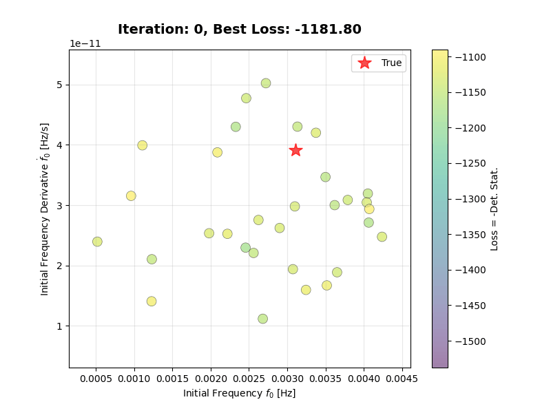

# EMRI Search

This repository implements a search pipeline for detecting Extreme Mass Ratio Inspirals (EMRIs) in simulated LISA data. Given input LISA time-series, the pipeline returns the best-matching instantaneous frequency evolution (track) found in the data. The code accompanies the related paper: https://arxiv.org/pdf/2506.09470.

Example outputs
- Comparison between the injected EMRI signal (plus noise) and the recovered signal after masking the best-fit track. Reproduce with `QuickStartEMRIsearch.ipynb`.


- Optimization and track evolution visualizations. Reproduce with `QuickStartEMRIsearch.ipynb`.

<p align="center">
  
  
</p>

## Table of Contents
- [Installation](#installation)
- [Quick Start](#quick-start)
- [Repository Structure](#repository-structure)
- [Core Utilities](#core-utilities)
- [Notebooks](#notebooks)
- [Citation](#citation)
- [License](#license)
- [Contact](#contact)

## Installation

### Create a conda environment
Recommended minimal environment:
```bash
conda create -n emri -y python=3.12
conda activate emri
pip install eryn fastemriwaveforms multiprocess optax matplotlib scipy jupyter interpax matplotlib-label-lines lisaanalysistools astropy corner pastamarkers
```

On many Linux systems `fastlisaresponse` installs with:
```bash
pip install fastemriwaveforms
```

On macOS arm64 a working build sequence used by the author:
```bash
git clone https://github.com/mikekatz04/lisa-on-gpu.git
cd lisa-on-gpu

conda install conda-forge::clang_osx-arm64 conda-forge::clangxx_osx-arm64 -y
export CC=$(which clang)
export CXX=$(which clang++)
export CFLAGS="-march=native"
export CXXFLAGS="-march=native"

pip install .
python -m unittest discover
```

Quick test for the response code:
```bash
python da_utils.py
```

## Quick Start

Open `QuickStartEMRIsearch.ipynb` and run the notebook. It guides you through:
- generating EMRI test signals,
- computing Short Fourier Transforms (SFTs),
- computing the detection statistic,
- and running example searches that reproduce the figures above.

## Repository Structure

High-level layout and purpose of important files.

### Notebooks
- `QuickStartEMRIsearch.ipynb` — hands-on tutorial showing full examples: signal generation, SFTs, detection statistics, and simple searches.

### Core Utilities

Data analysis and waveform helpers:
- `da_utils.py` — SFT computation, frequency-domain inner products, noise generation, SNR calculation.
- `emri_utils.py` — EMRI waveform and trajectory helpers
- `search_utils.py` — detection statistics and search routines

### JAX / GPU-Accelerated Utilities
- `jax_utils.py` — JAX implementations of core routines for GPU/TPU acceleration (PSDs, detection statistics).
- `jax_de_utils.py` — differential-evolution optimization implemented with JAX for fast population-based searches.
- `draw_population.py` — draw synthetic EMRI populations and parameter transforms.

## Citation

If you use this code, please cite the paper linked at the top. Replace the placeholder below once the final citation is available:
```
[Paper citation - to be added upon publication]
```

## License

License information not included here. Add a LICENSE file or update this section with the chosen license.

## Contact

For questions or issues open an issue on the GitHub repository

