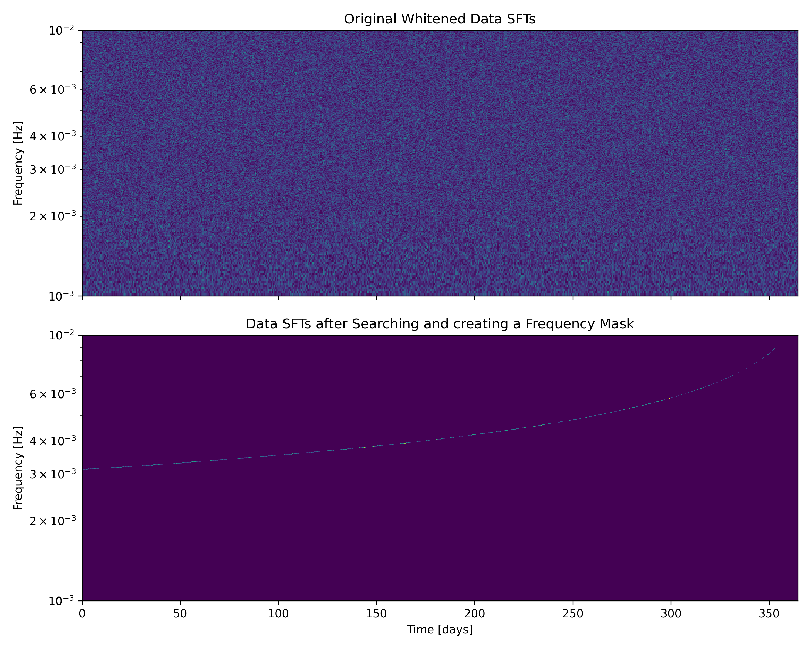

# DataAnalysisWithSFT

This repository implements a search algorithm for detecting Extreme Mass Ratio Inspirals (EMRIs) in LISA data. The pipeline takes as input simulated LISA data and outputs the best frequency evolution found in the data. This repository accompanies the [paper](https://arxiv.org/pdf/2506.09470).

*Comparison between the injected EMRI signal plus noise and the recovered signal after masking the best fit track. Reproduce this plot using [QuickStartEMRIsearch.ipynb](QuickStartEMRIsearch.ipynb).*



*Optimization procedure of the detection statistic for finding the best frequency track. Reproduce this plot using [QuickStartEMRIsearch.ipynb](QuickStartEMRIsearch.ipynb).*

<p align="center">
  
  
</p>


## Table of Contents
- [Installation](#installation)
- [Quick Start](#quick-start)
- [Repository Structure](#repository-structure)
- [Core Utilities](#core-utilities)
- [Analysis Scripts](#analysis-scripts)
- [Notebooks](#notebooks)
- [HPC Scripts](#hpc-scripts)
- [Data Files](#data-files)

## Installation

### Basic Installation

Create a conda environment and install the required packages:

```bash
conda create -n sft -y python=3.12 
conda activate sft
pip install eryn fastemriwaveforms multiprocess optax matplotlib scipy jupyter sbi interpax matplotlib-label-lines
```

These packages should be enough to run a search without on the plus polarization.

### Optional: Fast LISA Response

If you want to include the LISA response calculations we need to install the following packages (requires C++ compiler):

```bash
pip install fastlisaresponse lisaanalysistools
```

If compilation fails, specify the clang compilers:

```bash
which clang
which clang++

export CXXFLAGS="-march=native"
export CFLAGS="-march=native"
export CC=$(which clang)
export CXX=$(which clang++)

pip install fastlisaresponse lisaanalysistools
```

## Quick Start

### Tutorial Notebook
Start with the quick start guide:
```bash
jupyter notebook QuickStartEMRIsearch.ipynb
```

### Run a Search
```bash
python jax_search.py --m1 1e6 --m2 10 --a 0.9 --ef 0.1 --T_data 1.0 --snr_ref 30.0
```

### Analyze Results
```bash
jupyter notebook analyze_search.ipynb
```

## Repository Structure

### Core Utilities

**Data Analysis Utilities**
- `da_utils.py` - Core SFT computation, inner products, noise generation, SNR calculation
  - `compute_sfts()` - Compute Short Fourier Transforms
  - `sft_inner_product()` - Inner product in frequency domain
  - `generate_noise()` - Gaussian noise generation with given PSD
  - `get_snr()` - Calculate signal-to-noise ratio
  - `psd()` - Power spectral density function (LISA/TDI)

**EMRI Utilities**
- `emri_utils.py` - EMRI-specific waveform generation and trajectory utilities
  - `create_signal()` - Generate EMRI gravitational wave signals
  - `get_f_fdot_fddot_back()` - Compute frequency evolution from backward integration
  - `get_response_generator()` - LISA response wrapper for waveforms

**Search Utilities**
- `search_utils.py` - Detection statistics and search algorithms
  - Detection statistic computation
  - Template generation for frequency-derivative space
  - Signal generation utilities for searches

**SVD Utilities**
- `svd_utils.py` - Singular Value Decomposition for dimensionality reduction
  - SVD basis generation for frequency-derivative templates
  - Training matrix creation
  - Projection and reconstruction utilities

**JAX Utilities (GPU-Accelerated)**
- `jax_utils.py` - JAX versions of core utilities for GPU/TPU acceleration
  - GPU-accelerated PSD, detection statistics
  - Compatible with `search_utils.py` but optimized for JAX
  
- `jax_de_utils.py` - Differential evolution optimization with JAX
  - Population-based optimization
  - GPU-accelerated evolutionary algorithms

- `parameter_space.py` - Parameter space analysis and visualization
  - Analyze coverage of EMRI parameter space compared to GBs


### Analysis Scripts

**Main Analysis Scripts**

- `draw_population.py` - Generate synthetic EMRI populations
  - Draw populations from distributions
  - Parameter scaling and transformation utilities

- `jax_search.py` - GPU-accelerated search for EMRIs
  - Differential evolution-based search
  - JAX-optimized for high performance
  - Usage: `python jax_search.py --m1 <mass1> --m2 <mass2> --a <spin> ...`

- `followup.py` - Follow-up analysis of EMRI search results
  - Loads search results and noise from HDF5 files
  - Optionally generates fresh noise realizations for robustness testing
  - Runs MCMC parameter estimation using the Eryn sampler
  - Produces corner plots and diagnostic outputs
  - Usage: `python followup.py --filename <search_dir> [--generate-noise] [--noise-seed <seed>] [--save-noise]`

- `mcmc_emri.py` - MCMC parameter estimation for detected signals
  - Bayesian parameter inference using Eryn
  - Posterior sampling for EMRI parameters

- `sbi_emri_full.py` - Simulation-Based Inference for parameter estimation
  - Neural density estimation
  - Likelihood-free inference

### Notebooks

- `QuickStartEMRIsearch.ipynb` - **Tutorial**: Introduction to EMRI searches with SFTs
  - How to generate signals
  - How to compute detection statistics
  - Basic search examples

- `analyze_search.ipynb` - **Analysis**: Detailed postprocessing of search results

### HPC Scripts

Scripts for running on High-Performance Computing clusters:

**Python postprocessing**

- `get_best_across_T.py` - Aggregate best detection results across observation times
  - Compare detection statistics for different durations

**SLURM (Spider cluster)**
- `slurm_submit.sh` - SLURM batch submission script
- `pyslurm_submit.py` - Python wrapper for SLURM submissions

**HTCondor**
- `condor_submit.sh` - Condor submission wrapper
- `submit.submit` - Condor job description file
- `pycondor_submit.py` - Python wrapper for Condor submissions

**Batch Processing**
- `multiple_submissions.sh` - Submit multiple jobs with parameter variations

### Data Files

**Input Data**
- `LPA.txt` - LISA Pathfinder-derived PSD model
- `TDI2_AE_psd.npy` - TDI channel A+E power spectral density
- `equalarmlength-orbits.h5` - LISA satellite orbit data

**Pre-computed Models**
- `svd_basis_*.npz` - SVD basis functions for various SFT durations
- `new_svd_basis_Tsft50000.0_cut20.npz` - SVD basis for T_sft=50,000s
- Various `.npz` files containing pre-trained SVD decompositions

### Output Directories

- `figures/` - Generated plots and publication figures
- `tdi_search_9_m1_1.34e+06_m2_27.1_a0.86_Tpl0.90_ef0.007_seed282019_snr30.0/` - example results

## Usage Examples

### Run a Search

```bash
# JAX-accelerated search on GPU
python jax_search.py \
    --m1 1e6 \
    --m2 10.0 \
    --a 0.9 \
    --Tpl 0.7 \
    --ef 0.1 \
    --T_data 1.0 \
    --snr_ref 30.0 \
    --output_dir my_search_results
```

### Run SBI 

```bash
python sbi_emri_full.py
```

### Run follow up analysis 

```bash
python followup.py
```

## HPC Usage

### SLURM (Spider/Cartesius)

```bash
# Interactive GPU session
srun --partition=gpu_a100_22c --time=01:00:00 --gpus=a100:1 --pty bash -i

# Submit batch job
sbatch slurm_submit.sh
```

### HTCondor

```bash
# Submit single job
condor_submit submit.submit

# Submit multiple jobs
bash multiple_submissions.sh
```

### Container on Spider

Build a writable container for GPU computing:

```bash
singularity build --sandbox sandbox-jax docker://ghcr.io/nvidia/jax:jax
singularity shell --writable sandbox-jax

# Inside container
python3 -m pip install --upgrade pip
pip install eryn fastemriwaveforms multiprocess optax matplotlib scipy jupyter interpax

export CXXFLAGS="-march=native"
export CFLAGS="-march=native"
export CC=clang
export CXX=clang++

git clone https://github.com/mikekatz04/lisa-on-gpu.git
cd lisa-on-gpu
python scripts/prebuild.py
pip install .
```

## Citation

If you use this code, please cite:

```
[Paper citation - to be added upon publication]
```

## License

[License information - to be added]

## Contact

For questions or issues:
- Open an issue on GitHub
- Contact the authors
